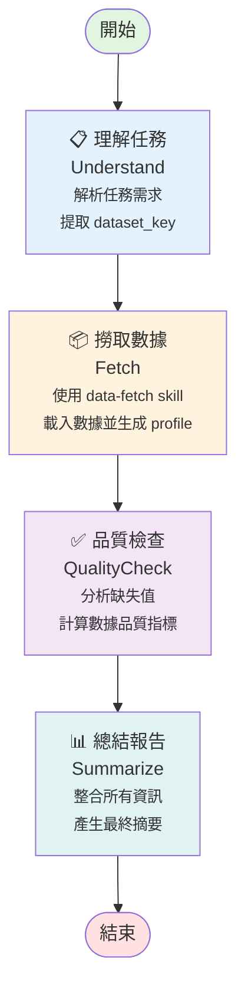

# Take Data Test Flow - 流程圖

## 流程概覽



## 階段說明

### 1️⃣ 理解任務 (Understand)
- **功能**: 解析使用者輸入的任務描述
- **輸出**: 提取資料集識別碼 (`dataset_key`)
- **範例**: "撈取 sales 數據" → `dataset_key = "sales"`

### 2️⃣ 撈取數據 (Fetch)
- **功能**: 使用 data-fetch skill 載入數據
- **處理**: 
  - 從 `mock_data/` 載入對應的 CSV 檔案
  - 生成數據 profile（行數、欄位數、缺失值統計等）
- **輸出**: `profile` 物件包含完整的數據概況

### 3️⃣ 品質檢查 (QualityCheck)
- **功能**: 分析數據品質指標
- **檢查項目**:
  - 缺失值數量與比例
  - 時間戳記欄位存在性
  - 數據完整性評估
- **輸出**: `quality_report` 包含品質狀態與詳細指標

### 4️⃣ 總結報告 (Summarize)
- **功能**: 整合所有階段的資訊
- **內容**: 
  - 資料集名稱與大小
  - 品質狀態摘要
  - 時間範圍（如有）
- **輸出**: 易讀的文字摘要

## 技術實作

- **框架**: LangGraph
- **語言**: Python 3.x
- **狀態管理**: TypedDict 定義的 `FlowState`
- **執行模式**: 線性管道 (Linear Pipeline)

## 使用範例

```python
from flows.take_data_test import graph

# 執行流程
result = graph.invoke({
    "task": "撈取 sales 數據並分析品質",
    "dataset_key": None,
    "profile": None,
    "quality_report": None,
    "summary": None,
    "error": None
})

# 查看結果
print(result["summary"])
```

## 相關檔案

- [graph.py](./graph.py) - 主要實作程式碼
- [run.py](./run.py) - 測試執行入口
- [../../specs/take-data-test.flow_spec.yaml](../../specs/take-data-test.flow_spec.yaml) - Flow 規格定義
